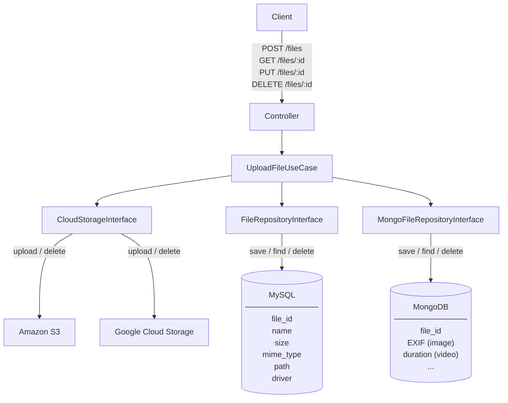

## Architecture

```mermaid
flowchart TD
    Client["Client"] -->|"POST /files\nGET /files/:id\nPUT /files/:id\nDELETE /files/:id"| Controller["Controller"]

    Controller --> UseCase["UploadFileUseCase"]

    UseCase --> CloudStorage["CloudStorageInterface"]
    UseCase --> FileRepo["FileRepositoryInterface"]
    UseCase --> MongoRepo["MongoFileRepositoryInterface"]

    CloudStorage -->|"upload / delete"| S3["Amazon S3"]
    CloudStorage -->|"upload / delete"| GCS["Google Cloud Storage"]

    FileRepo -->|"save / find / delete"| MySQL[("MySQL\n─────────────\nfile_id\nname\nsize\nmime_type\npath\ndriver")]

    MongoRepo -->|"save / find / delete"| MongoDB[("MongoDB\n─────────────\nfile_id\nEXIF (image)\nduration (video)\n...")]
```
